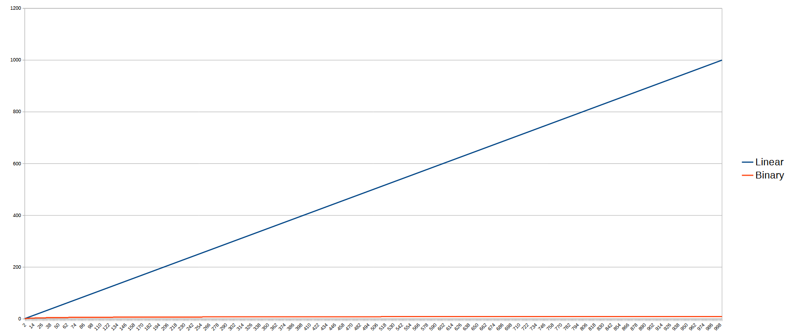

# Algorithms and Data Structures - Binary search


## What is binary search?

Binary search is a search algorithm that finds the position of a target value within a sorted array. Binary search compares the target value to the middle element of the array. If they are not equal, the half in which the target cannot lie is eliminated and the search continues on the remaining half, again taking the middle element to compare to the target value, and repeating this until the target value is found. If the search ends with the remaining half being empty, the target is not in the array.

The concept behind binary search is to "divide and conquer" continuously dividing the number of candidate elements in half at each iteration. This property enables the algorithm to have a time complexity of `O(log n)`.

### Pros
* `O(log n)` time complexity. It's one of the fastest search algorithms;
* It's simple to implement;
* It's easy to understand;


### Cons
* It only works on sorted arrays;
* Time complexity for insertion is `O(log n)`. I put this as a cons because exists algorithms with `O(1)` time complexity for insertion, but that is not a big deal for many cases because `O(log n)` is still very good performance;


### Requirements
* The array must be sorted;
* To use the binary search algorithm, the array must be random-access, which means that elements can be accessed using their index;
* The data stored in the array must be of a type that supports comparison. For example `a < b`, `a > b`, `a == b`;
* The comparison used to search value in the array must be the same used to sort or insert values in the array;

### Time complexity (Binary search vs. linear search)

In the previous graph, we can see the number of steps required to find a value increases very slowly as the size of the array increases using binary search in comparison with linear search.

### Demo animation

[Binary search vs linear search](https://www.cs.usfca.edu/~galles/visualization/Search.html)


## Implementations

The binary search algorithm can be implemented in different ways. Interative and recursive are the most common implementations.

For my examples, I am going to use the C#, but the algorithm can be implemented in any language. Only the syntax will change.

### Interative implementation

```csharp
static int BinarySearch(int[] array, int search)
{
    var left = 0;
    var right = array.Length - 1;

    while (left <= right)
    {
        var middle = left + ((right - left) / 2);
        if (array[middle] == search)
        {
            return middle;
        }

        if (array[middle] < search)
        {
            left = middle + 1;
        }
        else
        {
            right = middle - 1;
        }
    }

    return -1;
}
```

### Recursive implementation

```csharp
static int BinarySearch(int[] array, int search, int left, int right)
{
    while(left <= right)
    {
        var middle = left + ((right - left) / 2);

        if(search == array[middle])
        {
            return middle;
        }

        if(search > array[middle])
        {
            return BinarySearch(array, search, middle + 1, right);
        }

        return BinarySearch(array, search, left, middle - 1);
    }

    return -1;
}
```

### Some tips to implement binary search

#### Found the middle index

It is very common to see the middle index calculation as `(left + right) / 2`, but this is not the best way to do it. If the array is very large, the sum of `left` and `right` can overflow the maximum value of the integer type. To avoid this problem, we can use the following formula: `left + ((right - left) / 2)`.

Let's break down this formula piece by piece to understand the problem.

```csharp
Console.WriteLine($"MaxInt: {int.MaxValue:n0}"); // MaxInt: 2 147 483 647

var left = int.MaxValue - 1_000;
var right = int.MaxValue - 300;

Console.WriteLine($"left: {left:n0}"); // left: 2 147 482 647
Console.WriteLine($"right: {right:n0}"); // right: 2 147 483 347

// Bad why
var badWhyStep1 = left + right;
Console.WriteLine($"Bad why -> left + right: {badWhyStep1:n0}"); // Bad why -> left + right: -1 302
var badWhyStep2 = badWhyStep1 / 2;
Console.WriteLine($"Bad why -> (left + right) / 2: {badWhyStep2:n0}"); // Bad why -> (left + right) / 2: -651

// Good why
var goodWhyStep1 = right - left;
Console.WriteLine($"Good why -> right - left: {goodWhyStep1:n0}"); // Good why -> right - left: 700
var goodWhyStep2 = goodWhyStep1 / 2;
Console.WriteLine($"Good why -> (right - left) / 2: {goodWhyStep2:n0}"); // Good why -> (right - left) / 2: 350
var goodWhyStep3 = left + goodWhyStep2;
Console.WriteLine($"Good why -> left + ((right - left) / 2): {goodWhyStep3:n0}"); // Good why -> left + ((right - left)) / 2: 2 147 482 997 // right: 2 147 483 147
```

As you can see, for a large array, the `left + right` operation can overflow the maximum value of the integer type and return a worng value.

#### Use shift operator
In the built-in binary search implementation of some languages, you can see the use of the shift operator `>> 1` to divide the value by 2.
First we can do this because the shift operation `>> 1` is equivalent to the division by 2. Second because the bitwise operations are more close to the machine code and can be faster than the division operation.

**Before**
```csharp
var middle = left + ((right - left) / 2);
```

**After**
```csharp
var middle = left + ((right - left) >> 1);
```

#### Return the complement of the index if the value is not found

In the previous examples, I returned `-1` when the value was not found. Using the condition `index < 0` serves as an indicator that the value was not located. However, suppose we also want to use the same implementation to identify the next suitable index for inserting the value. In this scenario, the index `-1` is not particularly helpful.

We know that when we attempt to search for a value in our sorted array, the algorithm will halt either when it finds the value or when it doesn't. If the value is not found, the left index will point to the position where the value should be inserted.

With this in mind, if the value is not found, we can simply use the `~` operator. This operator inverts all bits, including the sign bit, resulting in a negative value. We can use this negative value to signify that the value was not found. However, if we apply the complement operation once more, we obtain the position where the value should be inserted. This approach allows us to use the same implementation for both finding a value and determining the next possible insertion point.

```csharp
public void Add(int item)
{
    var position = Search(item);
    if(position < 0)
    {
        position = ~position;
    }
    items.Insert(position, item);
}

public int Search(int item)
{
    // ...
    // When the value is not found
    return ~left;
}
```

#### Binary search is not only for numbers

The binary search algorithm does not work only with numbers. It can be used with any type of data that supports comparison. For example in C# you can a class and implement the `IComparable` interface to to define the comparison logic.

```csharp
public int BinarySearch(T item)
{
    var left = 0;
    var right = _items.Count - 1;

    while(left <= right)
    {
        var middle = left + ((right - left) >> 1);

        if(_items[middle].CompareTo(item) == 0)
        {
            return middle;
        }

        if(_items[middle].CompareTo(item) < 0)
        {
            left = middle + 1;
        }
        else
        {
            right = middle - 1;
        }
    }

    return ~left;
}

public class Person : IComparable<Person>
{
    public string? FirstName { get; set; }
    public string? LastName { get; set; }
    public int Age { get; set; }

    public int CompareTo(Person? other)
    {
        if(other is null)
        {
            return -1;
        }

        var result = Age.CompareTo(other.Age);
        if(result != 0)
        {
            return result;
        }

        result = compareTo(FirstName, other?.FirstName);
        if(result != 0)
        {
            return result;
        }

        return compareTo(LastName, other?.LastName);


        static int compareTo(string? left, string? right)
        {
            if(left is null && right is null)
            {
                return 0;
            }

            if(left is null)
            {
                return -1;
            }

            if(right is null)
            {
                return 1;
            }

            return left.CompareTo(right);
        }
    }
}
```


[Medium Post](https://medium.com/@NelsonBN/algorithms-and-data-structuresbinary-search-a12594183c0d)